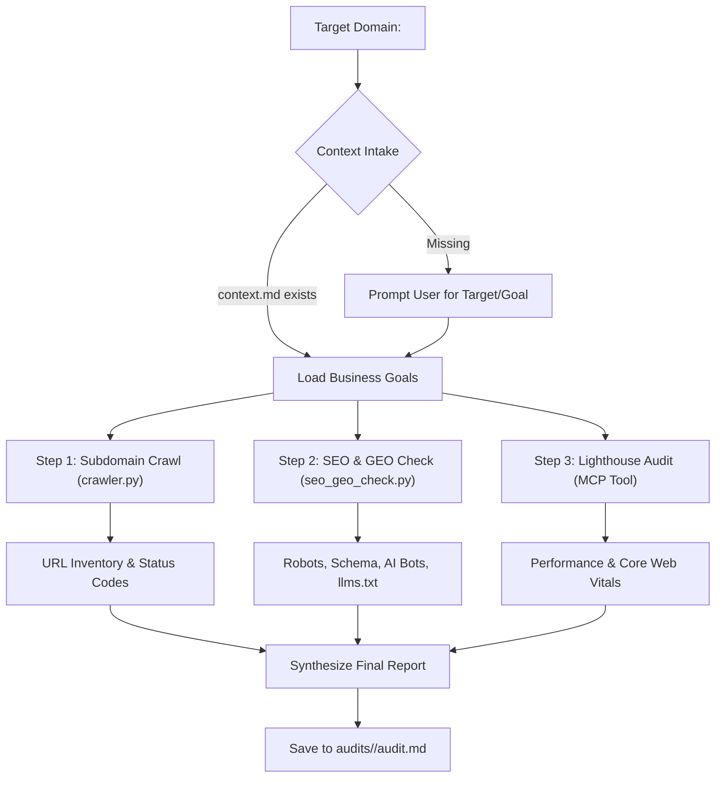

# Website Auditor Agent Directives & Architecture

Specialized agent configurations, skills, and execution protocols for auditing websites across technical SEO, Generative Engine Optimization (GEO), and Lighthouse performance.

---

## 1. Specialist Personas & Directives

### 1.1 Technical SEO Specialist
- **Engines:** Google, Bing, Brave Search.
- **Directives:**
  - Audit crawlability: inspect status codes, redirect chains, canonical tags, and `/robots.txt`.
  - Validate XML sitemap presence and indexing hygiene.
  - Review semantic HTML structure: unique descriptive `<title>` (30-65 chars), `<meta name="description">` (70-160 chars), exactly one `<h1>` per page, and logical `<h2>`/`<h3>` hierarchy.
  - Check OpenGraph tags for rich social snippets and cross-indexer discovery.

### 1.2 Generative Engine Optimization (GEO) Specialist
- **AI Search Engines:** ChatGPT Search, Perplexity AI, Claude, Google AI Overviews (AIO), Microsoft Copilot.
- **Directives:**
  - **AI Bot Access:** Verify `robots.txt` explicitly allows modern retrieval agents (`GPTBot`, `ClaudeBot`, `PerplexityBot`, `Google-Extended`, `Bytespider`, `CCBot`).
  - **Entity Disambiguation:** Verify Schema.org JSON-LD data (`Organization`, `Service`, `FAQPage`, `Article`).
  - **Extractability & Chunkability:** Content must provide direct answer nuggets (40-80 words), structured comparison tables, and question-based headers.
  - **LLM Context Standards:** Check for `/llms.txt` and `<link rel="describedby" href="...">` in HTML `<head>`.

### 1.3 Performance & Core Web Vitals Auditor
- **Tooling:** Lighthouse via `chrome-devtools` or `playwright`.
- **Directives:**
  - Audit Core Web Vitals: LCP ($\le 2.5\text{s}$), INP ($\le 200\text{ms}$), CLS ($\le 0.1$).
  - Measure Accessibility, Best Practices, and SEO scores.

---

## 2. Directory & Reporting Conventions

```text
website-auditor-skills/
├── AGENTS.md                          # Master directives (this document)
├── pyproject.toml                     # Python dependencies (managed via uv)
├── .agents/
│   └── skills/
│       └── website-audit/
│           ├── SKILL.md               # Main audit execution skill
│           ├── scripts/
│           │   ├── crawler.py         # Subdomain crawler (<300 lines)
│           │   └── seo_geo_check.py   # Multi-engine SEO/GEO analyzer (<300 lines)
│           └── references/
│               ├── seo_guidelines.md  # Multi-engine SEO rules
│               └── geo_guidelines.md  # GEO & AI search rules
└── audits/
    └── <sub.domain.me>/
        ├── context.md                 # User-provided context (optional intake)
        └── audit.md                   # Final standardized audit report
```

### Context Intake Rule
Before auditing a target domain `<sub.domain.me>`:
1. Check if `audits/<sub.domain.me>/context.md` exists. If present, load business goals, target audience, and key competitors.
2. **If missing:** Prompt the user interactively:
   > *"No context file found at `audits/<sub.domain.me>/context.md`. What is the primary target or business goal of this website, and who is the ideal audience?"*

### Report Delivery Rule
All audit reports must be saved directly to `audits/<sub.domain.me>/audit.md`.

---

## 3. Tooling & MCP Requirements

This repository requires **one of the following browser MCP servers** for Lighthouse and rendered inspection. Register the chosen server in the agent/client MCP configuration (`mcpServers` JSON — exact location depends on the client: Claude Code, Cursor, VS Code, Copilot, Antigravity, etc.).

### 3.1 Prerequisites (install if missing)

| Dependency | Required by | Minimum version |
| --- | --- | --- |
| **Node.js + npm/npx** | Both MCP servers | Node.js 20+ (LTS recommended for `chrome-devtools`) |
| **Google Chrome stable (or Chrome for Testing)** | `chrome-devtools` | Current stable or newer |
| **Python + `uv`** | Audit scripts (`crawler.py`, `seo_geo_check.py`) and tests | Python 3.11+ (deps via `uv sync`) |
| **Playwright browser binaries** | `playwright` | Not installed by default — see below |

### 3.2 `chrome-devtools` (Recommended) — <https://github.com/ChromeDevTools/chrome-devtools-mcp>

Provides `lighthouse_audit`, `navigate_page`, `new_page`, `performance_start_trace`, screenshot/snapshot, and DOM evaluation. Runs ad-hoc via `npx`, no global install:

```json
{
  "mcpServers": {
    "chrome-devtools": {
      "command": "npx",
      "args": ["-y", "chrome-devtools-mcp@latest"]
    }
  }
}
```

Optional flags (append to `args`):
- `"--headless"` — run without a visible browser window.
- `"--slim"` — reduced tool surface (used with `--headless` for CI).
- `"--no-usage-statistics"` — opt out of Google usage stats (also auto-disabled when `CI` is set).

Smoke test: *"Check the performance of https://developers.chrome.com"*.

### 3.3 `playwright` — <https://playwright.dev/docs/getting-started-mcp>

Provides `browser_navigate`, `browser_snapshot` (accessibility tree), `browser_click`, `browser_type`, `browser_evaluate`, and client-side DOM evaluation. Runs ad-hoc via `npx`, no global install:

```json
{
  "mcpServers": {
    "playwright": {
      "command": "npx",
      "args": ["@playwright/mcp@latest"]
    }
  }
}
```

First run may require browser binaries:

```bash
npx playwright install chromium   # or firefox / webkit / msedge
```

Optional flags (append to `args`): `"--headless"`, `"--browser=firefox"`, `"--browser=webkit"`, `"--browser=msedge"`.

Smoke test: *"Navigate to https://demo.playwright.dev/todomvc and add a few todo items."*

### 3.4 Python dependencies

```bash
uv sync   # installs httpx + beautifulsoup4 (runtime) and pytest + pytest-asyncio (dev)
```

---

## 4. Execution Workflow



### Quick Commands
```bash
# Run full subdomain crawl
uv run python .agents/skills/website-audit/scripts/crawler.py https://<sub.domain.me> -o /tmp/crawl.json

# Run multi-engine SEO and GEO analysis
uv run python .agents/skills/website-audit/scripts/seo_geo_check.py https://<sub.domain.me> -o /tmp/seo_geo.json

# Run all test suites
uv run pytest
```
